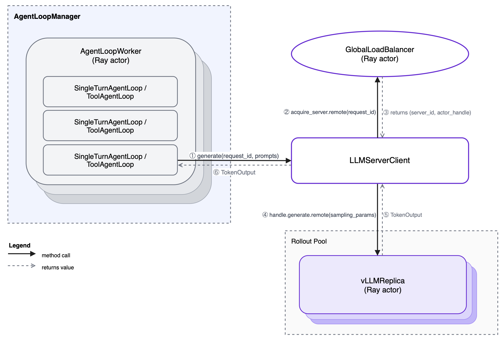

# llm-d RL verl Integration

Integrates [llm-d](https://github.com/llm-d/llm-d) into [verl](https://github.com/volcengine/verl) RL training rollouts, introducing llm-d's inference router and PD capabilities via llm-d's PD sidecar.

Integration are wired in through Hydra config — no verl source changes.
This repo introduces to approaches:
1. Epp as the rollout router.
2. Llmd stack as the inference backend.

---

## Integrations point

During each training step verl drives generation through the following component hierarchy:



`LLMServerClient` is the object `AgentLoopWorker` calls for every generation request. verl's default implementation uses `GlobalRequestLoadBalancer` to select replicas by least in-flight requests, with sticky sessions for multi-turn continuity.

This integration replaces two components:

- **`AgentLoopManager`** — extended to start EPP, and optionally Envoy, wrapped with Ray actors pinned to the head node, and to inject a custom `LLMServerClient` into each `AgentLoopWorker`.
- **`LLMServerClient`** — replaced with `EPPLLMClient` or `EnvoyLLMClient`, both routing through EPP's scoring system.

---

## Integration 1 — EPP as a router (direct gRPC)

### Overview

The point of the integration is to utilize EPP as the routing stategy.
Each generation request is sent to the **Endpoint Picker Plugin (EPP)** via gRPC ext_proc.  EPP scores all available vLLM replicas (prefix-cache hit rate, queue depth, KV utilisation) and injects the chosen backend address as a header.  The `EPPLLMClient` reads that header and forwards the request directly to the selected vLLM replica.


### How the lifecycle works

After all vLLM replicas are up:

1. `EnvoyAgentLoopManager` creates `LlmdActor` — a Ray actor **pinned to the head node** that starts EPP.
2. The actor:
   a. Writes the EPP endpoints YAML on the head node.
   b. Starts the EPP subprocess.
   c. Returns EPP gRPC address.
3. `_create_llm_client` builds `EPPLLMClient` with that address.

**EPPLLMClient:**
When `.generate()` is called on `EPPLLMClient`, it sends a gRPC ext_proc request to the EPP subprocess. After receiving the selected endpoint, it maps the address to the matching inference engine replica's Ray actor handle and calls `.generate()` on it directly — the same path as verl's built-in `LLMClient`, but with EPP-driven replica selection instead of least-in-flight load balancing.

### Config variables

| Key | Required | Default | Description |
|-----|----------|---------|-------------|
| `rollout.agent.agent_loop_manager_class` | yes | — | `llm_d_rl_verl_integration.epp_router.agent_loop_manager.EPPAgentLoopManager` |
| `rollout.custom.epp_config_file` | yes | — | Path to EPP YAML config (plugin list, scorers) |
| `rollout.custom.epp_endpoints_file` | yes | — | Path where the endpoints YAML is written; must match `epp_config_file` discovery path |
| `rollout.custom.epp_grpc_port` | no | `9002` | EPP gRPC ext_proc port |
| `rollout.custom.epp_grpc_health_port` | no | `9003` | EPP gRPC health check port |
| `rollout.custom.epp_pool_name` | no | `file-discovery` | EPP pool name |
| `rollout.custom.epp_pool_namespace` | no | `default` | EPP pool namespace |
| `rollout.custom.sidecar_connector` | PD only | — | KV transfer connector (e.g. `nixlv2`) — see [PD Disaggregation](#pd-disaggregation----vllm-llmd-pd) |

---

## Integration 2 — LLmd Stack (Envoy + EPP - HTTP proxy)

### Overview

This integration uses llmd as the rollout backned, meaning, we are treating Envoy as the single rollout endpoint (Note: llm inference engine are still laumnched by verl).
All generation requests are sent to a single **Envoy** proxy endpoint. Envoy calls EPP via gRPC ext_proc to pick the best replica, then forwards the request to it. verl workers only ever speak HTTP to one address; all routing intelligence lives inside Envoy + EPP on the head node.

< put similar graph >
### How the lifecycle works

After all vLLM replicas are up:

1. `EnvoyAgentLoopManager` creates `LlmdActor` — a Ray actor **pinned to the head node** that starts EPP and Envoy.
2. The actor:
   a. Writes the EPP endpoints YAML on the head node.
   b. Starts the EPP subprocess.
   c. Starts the Envoy subprocess.
   d. Returns `<head-node-ip>:8081` as the Envoy address.
3. `_create_llm_client` builds `EnvoyLLMClient` with that address.

**EnvoyLLMClient:**
When `.generate()` is called on `EnvoyLLMClient`, it sends an HTTP request to the local Envoy proxy. Envoy calls EPP via gRPC ext_proc to select a replica, then forwards the request to it using an `ORIGINAL_DST` cluster driven by the address EPP injects into the response header.

### Config variables

| Key | Required | Default | Description |
|-----|----------|---------|-------------|
| `rollout.agent.agent_loop_manager_class` | yes | — | `llm_d_rl_verl_integration.llmd_stack.agent_loop_manager.EnvoyAgentLoopManager` |
| `rollout.custom.epp_config_file` | yes | — | Path to EPP YAML config |
| `rollout.custom.epp_endpoints_file` | yes | — | Path where endpoints YAML is written |
| `rollout.custom.envoy_config` | no | bundled `envoy.yaml` | Path to Envoy config YAML |
| `rollout.custom.envoy_port` | no | `8081` | Envoy listener port |
| `rollout.custom.epp_grpc_port` | no | `9002` | EPP gRPC ext_proc port |
| `rollout.custom.epp_grpc_health_port` | no | `9003` | EPP gRPC health check port |
| `rollout.custom.epp_pool_name` | no | `file-discovery` | EPP pool name |
| `rollout.custom.epp_pool_namespace` | no | `default` | EPP pool namespace |

For PD disaggregated mode see [PD Disaggregation](#pd-disaggregation----vllm-llmd-pd).

---

## PD Disaggregation — `vllm-llmd-pd`

Both integrations support PD (prefill-decode) disaggregation via `rollout.name=vllm-llmd-pd`.

Replicas are split into prefill and decode roles by `PDEngineReplicaFactory` (registered as the `vllm-llmd-pd` backend in verl's `RolloutReplicaRegistry`). The first `prefill_replicas` ranks become prefill; the remaining become decode. `world_size / tp_size` must equal `prefill_replicas + decode_replicas`.

- **Prefill replicas** (`PDPrefillVLLMHttpServer`) — launch vLLM with NIXL side-channel env vars so the decode sidecar can pull KV blocks from them. They never serve generate requests directly.
- **Decode replicas** (`PDDecodeVLLMHttpServer`) — launch vLLM with NIXL env vars, then spawn `llm-d-routing-sidecar` alongside it. The sidecar is the public endpoint: it receives the request, fetches the prompt KV cache from the prefill replica via NIXL, then decodes locally. `get_server_address()` returns the sidecar port, so EPP routes to the sidecar, not to vLLM directly.

Role labels (`llm-d.ai/role: prefill` / `decode`) are written to the EPP endpoints YAML so EPP's `prefill-filter` and `decode-filter` plugins route correctly.

### Config

| Key | Required | Description |
|-----|----------|-------------|
| `rollout.name` | yes | `vllm-llmd-pd` |
| `rollout.disaggregation.prefill_replicas` | yes | Number of prefill replicas |
| `rollout.disaggregation.decode_replicas` | yes | Number of decode replicas |
| `rollout.engine_kwargs.vllm.kv_transfer_config.kv_connector` | yes | `NixlConnector` |
| `rollout.engine_kwargs.vllm.kv_transfer_config.kv_role` | yes | `kv_both` |
| `rollout.engine_kwargs.vllm.no_disable_hybrid_kv_cache_manager` | yes | `true` |
| `rollout.custom.sidecar_connector` | no | KV connector type passed to `llm-d-routing-sidecar` (default: `nixlv2`) |
| `model.external_lib` | yes | `llm_d_rl_verl_integration.register_pd` — registers `vllm-llmd-pd` in FSDP workers |

The EPP config must use the PD-aware profile — `shared/epp-example-config-pd.yaml` — which includes `disagg-profile-handler`, `prefill-filter`, `decode-filter`, and `prefix-based-pd-decider`.  Using the non-PD config causes all requests to be load-balanced across both prefill and decode replicas without role-based routing, and NIXL KV transfer will not happen.

---

## How to run

See [examples/](examples/README.md) for a step-by-step KubeRay deployment walkthrough including manifests, EPP config setup, and training script examples.

---

## Debug logging

All integration components default to quiet logging.  Set these env vars to increase verbosity — either in the shell before launching training, or in the `env:` section of your KubeRay `RayCluster` / `RayJob` container spec.

| Env var | Component | Default | Debug value |
|---------|-----------|---------|-------------|
| `VERL_VLLM_LOG_LEVEL` | vLLM inside prefill and decode replicas (`VLLM_LOGGING_LEVEL`) | unset (vLLM default) | `DEBUG` |
| `VERL_SIDECAR_LOG_LEVEL` | llm-d routing sidecar (`--zap-log-level`) | `0` | `5` |
| `VERL_EPP_VERBOSITY` | EPP subprocess (`-v`) | `0` | `5` |
| `VERL_ENVOY_LOG_LEVEL` | Envoy proxy (`--log-level`) | `info` | `debug` |

*Note: Ray actors are spawned as new processes on remote nodes and do not inherit the launching shell's environment.*

With *KubeRay* — set in the container spec; vars are present before Ray starts:

```yaml
containers:
  - name: ray-worker
    env:
      - name: VERL_VLLM_LOG_LEVEL
        value: "DEBUG"
      - name: VERL_EPP_VERBOSITY
        value: "5"
```
