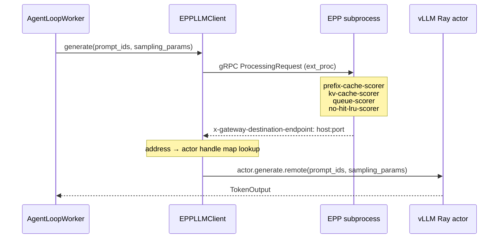
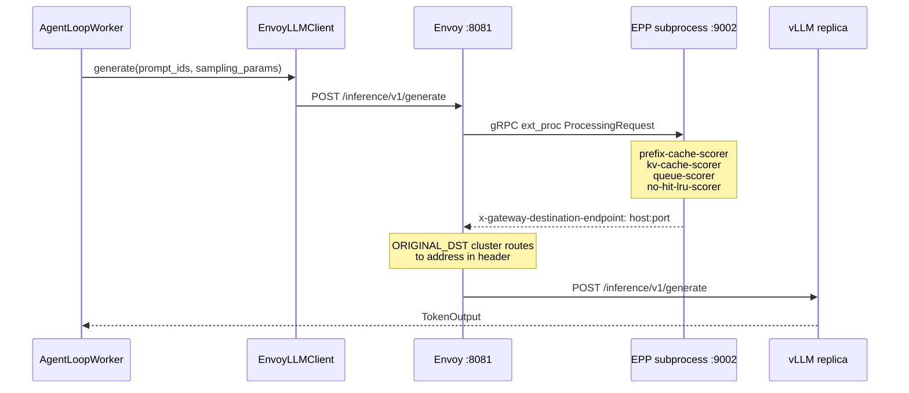

# llm-d RL verl Integration

Integrates [llm-d](https://github.com/llm-d/llm-d) into [verl](https://github.com/volcengine/verl) RL training rollouts, introducing llm-d's inference router and PD capabilities via llm-d's PD sidecar.

Integration are wired in through Hydra config — no verl source changes.
This repo introduces to approaches:
1. Epp as the rollout router.
2. Llmd stack as the inference backend.

---

## Integrations point

During each training step verl drives generation through the following component hierarchy:

< put a diagram >


`LLMServerClient` is the object `AgentLoopWorker` calls for every generation request. verl's default implementation uses `GlobalRequestLoadBalancer` to select replicas by least in-flight requests, with sticky sessions for multi-turn continuity.

This integration replaces two components:

- **`AgentLoopManager`** — extended to start EPP, and optionally Envoy, wrapped with Ray actors pinned to the head node, and to inject a custom `LLMServerClient` into each `AgentLoopWorker`.
- **`LLMServerClient`** — replaced with `EPPLLMClient` or `EnvoyLLMClient`, both routing through EPP's scoring system (prefix-cache hit rate, KV utilisation, queue depth).

---

## Integration 1 — EPP as a router (direct gRPC)

### Overview

The point of the integration is to utilize EPP as the routing stategy.
Each generation request is sent to the **Endpoint Picker Plugin (EPP)** via gRPC ext_proc.  EPP scores all available vLLM replicas (prefix-cache hit rate, queue depth, KV utilisation) and injects the chosen backend address as a header.  The `EPPLLMClient` reads that header and forwards the request directly to the selected vLLM replica.

### Components



### How the lifecycle works

After all vLLM replicas are up:

1. `EPPAgentLoopManager` spawns `EPPActor`, a Ray actor pinned to the head node, passing all replica addresses.
2. The actor writes `/tmp/epp-endpoints.yaml` and starts the EPP subprocess, waiting until its gRPC health check passes.
3. The returned EPP gRPC address is passed to `EPPLLMClient`, which is injected into every `AgentLoopWorker`.

### Config variables

| Key | Required | Default | Description |
|-----|----------|---------|-------------|
| `rollout.agent.agent_loop_manager_class` | yes | — | `llm_d_rl_verl_integration.epp_router.agent_loop_manager.EPPAgentLoopManager` |
| `rollout.custom.epp_config_file` | yes | — | Path to EPP YAML config (plugin list, scorers) |
| `rollout.custom.epp_endpoints_file` | yes | — | Path where the endpoints YAML is written; must match `epp_config_file` discovery path |
| `rollout.custom.epp_grpc_port` | no | `9002` | EPP gRPC ext_proc port |
| `rollout.custom.epp_grpc_health_port` | no | `9003` | EPP gRPC health check port |
| `rollout.custom.epp_pool_name` | no | `file-discovery` | EPP pool name |
| `rollout.custom.epp_pool_namespace` | no | `default` | EPP pool namespace |
| `rollout.custom.sidecar_connector` | PD only | — | KV transfer connector (e.g. `nixlv2`) — see [PD Disaggregation](#pd-disaggregation----vllm-llmd-pd) |

---

## Integration 2 — Envoy + EPP (HTTP proxy)

### Overview

This integration uses llmd as the rollout backned, meaning, we are treating Envoy as the single rollout endpoint (Note: llm inference engine are still laumnched by verl).
All generation requests are sent to a single **Envoy** proxy endpoint.  Envoy calls EPP via gRPC ext_proc to pick the best replica, then routes the request to it using an `ORIGINAL_DST` cluster driven by the `x-gateway-destination-endpoint` header EPP injects.  verl workers only ever speak HTTP to one address; all routing intelligence lives inside Envoy + EPP on the head node.

### Components



### How the lifecycle works

After all vLLM replicas are up:

1. `EnvoyAgentLoopManager` creates `LlmdStackActor` — a Ray actor **pinned to the head node** that wraps the EPP and Envoy.
2. The actor:
   a. Writes the EPP endpoints YAML on the head node.
   b. Starts the EPP subprocess and waits for its gRPC health check.
   c. Starts the Envoy subprocess (`--disable-hot-restart`) and waits for TCP on port 8081.
   d. Returns `<head-node-ip>:8081` as the Envoy address.
3. `_create_llm_client` builds `EnvoyLLMClient` with that address.


### Config variables

| Key | Required | Default | Description |
|-----|----------|---------|-------------|
| `rollout.agent.agent_loop_manager_class` | yes | — | `llm_d_rl_verl_integration.llmd_stack.agent_loop_manager.EnvoyAgentLoopManager` |
| `rollout.custom.epp_config_file` | yes | — | Path to EPP YAML config |
| `rollout.custom.epp_endpoints_file` | yes | — | Path where endpoints YAML is written |
| `rollout.custom.envoy_config` | no | bundled `envoy.yaml` | Path to Envoy config YAML |
| `rollout.custom.envoy_port` | no | `8081` | Envoy listener port |
| `rollout.custom.epp_grpc_port` | no | `9002` | EPP gRPC ext_proc port |
| `rollout.custom.epp_grpc_health_port` | no | `9003` | EPP gRPC health check port |
| `rollout.custom.epp_pool_name` | no | `file-discovery` | EPP pool name |
| `rollout.custom.epp_pool_namespace` | no | `default` | EPP pool namespace |

For PD disaggregated mode see [PD Disaggregation](#pd-disaggregation----vllm-llmd-pd).

---

## PD Disaggregation — `vllm-llmd-pd`

Both integrations support PD (prefill-decode) disaggregation via `rollout.name=vllm-llmd-pd`. This section describes the implementation behind that rollout backend.

### PDPrefillVLLMHttpServer and PDDecodeVLLMHttpServer

Both classes live in `llm_d_rl_verl_integration.shared.pd_replica` and extend verl's `vLLMHttpServer`.  The base class launches a vLLM HTTP server process and exposes `generate()` / `get_server_address()`.  Each subclass overrides specific methods to wire in NIXL and the llm-d sidecar.

**`PDPrefillVLLMHttpServer`**

Added on top of `vLLMHttpServer`:

- **`launch_server()`** — sets `VLLM_NIXL_SIDE_CHANNEL_HOST` and `VLLM_NIXL_SIDE_CHANNEL_PORT` env vars (and `UCX_TLS=cuda_ipc,cuda_copy,tcp`) before calling `super().launch_server()`.  This tells vLLM to advertise its NIXL side-channel so the decode replica can pull KV blocks from it.
- **`generate()`** — **unconditionally raises `RuntimeError`**.  The prefill server is never called directly by verl workers or EPP.  Its only job is to compute the prompt KV cache; the decode sidecar reaches it over HTTP using the address EPP injects as a routing header.

The corresponding replica class `PDPrefillEngineReplica` sets `self._engine_role = "prefill"`, which is used when writing the EPP endpoints YAML: `write_pd_endpoints()` sets `llm-d.ai/role: prefill` on every prefill address.  EPP's `prefill-filter` plugin selects only endpoints with this label.

**`PDDecodeVLLMHttpServer`**

Added on top of `vLLMHttpServer`:

- **`launch_server()`** — sets the same NIXL env vars as the prefill server, then overrides `self._server_address` to `127.0.0.1` before calling `super().launch_server()`, binding vLLM to loopback only (keeping it off the network). After the parent returns, restores the real node IP and calls `_launch_sidecar()`.
- **`_launch_sidecar()`** — spawns `llm-d-routing-sidecar` as a subprocess (`--port`, `--vllm-port`, `--kv-connector`, `--secure-proxy=false`).  The sidecar listens on a free port and proxies requests to vLLM on localhost, adding the two-phase prefill→NIXL→decode coordination.
- **`get_server_address()`** — returns `(node_ip, sidecar_port)` instead of the vLLM port.  This is the address written to the EPP endpoints YAML, so all traffic from EPP flows to the sidecar, not directly to vLLM.
- **`generate()`** — used by the **EPP-as-router integration** (`EPPLLMClient`), which calls `generate()` directly on the replica after EPP selects it.  Forwards the request to `http://localhost:<sidecar_port>/inference/v1/generate`, passing the EPP-injected headers (prefill target host/port, remote block IDs, NIXL params) as HTTP headers so the sidecar can orchestrate the remote prefill and KV transfer before decoding locally.  In the Envoy+EPP integration, verl workers never call `generate()` on the replica at all — requests go to Envoy, which routes to the sidecar directly.

The corresponding replica class `PDDecodeEngineReplica` sets `self._engine_role = "decode"`, so `write_pd_endpoints()` sets `llm-d.ai/role: decode` on every decode (sidecar) address.  EPP's `decode-filter` plugin selects only endpoints with this label, ensuring decode requests always land on a sidecar — never on a prefill replica.

### PDEngineReplicaFactory

`PDEngineReplicaFactory` (in `llm_d_rl_verl_integration.shared.pd_replica`) is **a factory function, not a class**.  It is registered as the `vllm-llmd-pd` backend in verl's `RolloutReplicaRegistry` at import time by each integration's `agent_loop_manager.py`:

```python
RolloutReplicaRegistry.register("vllm-llmd-pd", lambda: PDEngineReplicaFactory)
```

When verl calls the factory for `replica_rank`, it reads `config.disaggregation.prefill_replicas` and `decode_replicas` via `PDPoolCoordinator` and returns the correct replica type:

```
rank 0 … prefill_replicas - 1   →  PDPrefillEngineReplica  (uses PDPrefillVLLMHttpServer)
rank prefill_replicas … N - 1   →  PDDecodeEngineReplica   (uses PDDecodeVLLMHttpServer)
```

`PDPrefillEngineReplica` and `PDDecodeEngineReplica` are thin `vLLMReplica` subclasses that just swap in the matching server class above.

`world_size / tp_size` must equal `prefill_replicas + decode_replicas`.

### Config

These keys are required on top of the base integration config when running in PD mode (applies to both EPP-as-router and Envoy+EPP):

| Key | Required | Description |
|-----|----------|-------------|
| `rollout.name` | yes | `vllm-llmd-pd` |
| `rollout.disaggregation.prefill_replicas` | yes | Number of prefill replicas |
| `rollout.disaggregation.decode_replicas` | yes | Number of decode replicas |
| `rollout.engine_kwargs.vllm.kv_transfer_config.kv_connector` | yes | `NixlConnector` |
| `rollout.engine_kwargs.vllm.kv_transfer_config.kv_role` | yes | `kv_both` |
| `rollout.engine_kwargs.vllm.no_disable_hybrid_kv_cache_manager` | yes | `true` |
| `rollout.custom.sidecar_connector` | no | KV connector type passed to `llm-d-routing-sidecar` (default: `nixlv2`) |
| `model.external_lib` | yes | `llm_d_rl_verl_integration.shared.register_pd` — registers `vllm-llmd-pd` in FSDP workers |

`prefill_replicas + decode_replicas` must equal `world_size / tp_size` (total GPU count divided by tensor-parallel size).

### NIXL KV transfer config

NIXL is configured at the vLLM engine level via Hydra params (required for all PD scripts):

```
+actor_rollout_ref.rollout.engine_kwargs.vllm.kv_transfer_config.kv_connector=NixlConnector
+actor_rollout_ref.rollout.engine_kwargs.vllm.kv_transfer_config.kv_role=kv_both
+actor_rollout_ref.rollout.engine_kwargs.vllm.no_disable_hybrid_kv_cache_manager=true
```

The sidecar KV connector type is configured via `rollout.custom.sidecar_connector` (default: `nixlv2`).

The EPP config must use the PD-aware profile — `shared/epp-example-config-pd.yaml` — which includes `disagg-profile-handler`, `prefill-filter`, `decode-filter`, and `prefix-based-pd-decider`.  Using the non-PD config causes all requests to be load-balanced across both prefill and decode replicas without role-based routing, and NIXL KV transfer will not happen.

---

## How to run

Running the integration requires three things:

1. **A running Ray cluster** — any Ray cluster works (local, KubeRay, SSH).  The integration assumes the EPP and Envoy binaries are present on the head node (they are bundled in the provided container image).
2. **Install the integration package** on every node in the cluster:
   ```bash
   pip install -e /path/to/llm-d-rl-verl-integration
   ```
3. **Run verl's training entry-point** with the integration wired in via Hydra overrides — the two keys that activate the integration are `agent_loop_manager_class` and `epp_config_file`:
   ```bash
   python3 -m verl.trainer.main_ppo \
       ... \
       +actor_rollout_ref.rollout.agent.agent_loop_manager_class=llm_d_rl_verl_integration.epp_router.agent_loop_manager.EPPAgentLoopManager \
       +actor_rollout_ref.rollout.custom.epp_config_file=/path/to/epp-config.yaml \
       +actor_rollout_ref.rollout.custom.epp_endpoints_file=/tmp/epp-endpoints.yaml
   ```

   No other verl source changes or pre-start steps are needed.  EPP (and Envoy, in the Envoy+EPP integration) are started automatically as Ray actors by the manager after all vLLM replicas are up.

### KubeRay example

`examples/ray-cluster.yaml` deploys a single-node 8-GPU cluster: a headless ray-head pod (no GPU, runs the driver and GCS) and a ray-worker pod with 8 GPUs.  The `postStart` hook pre-downloads GSM8K and Qwen3-4B so training can start immediately once the pods are ready.

The training scripts in `examples/training-configs/` are derived from verl's `examples/grpo_trainer/run_qwen3_4b_fsdp.sh` — same GRPO/Qwen3-4B/FSDP defaults — with an `EXTRA` block that adds the integration Hydra overrides.  The only difference between the EPP-as-router and Envoy+EPP variants is the `agent_loop_manager_class`:

| Script | Routing | PD disaggregation |
|--------|---------|-------------------|
| `examples/training-configs/run_qwen3_4b_fsdp-8-gpus-epp.sh` | EPP direct gRPC | no |
| `examples/training-configs/run_qwen3_4b_fsdp-8-gpus-epp_pd.sh` | EPP direct gRPC | yes |
| `examples/training-configs/run_qwen3_4b_fsdp-8-gpus-llmd_stack.sh` | llm-d stack (Envoy + EPP) | no |
| `examples/training-configs/run_qwen3_4b_fsdp-8-gpus-llmd_stack_pd.sh` | llm-d stack (Envoy + EPP) | yes |

For PD scripts, `rollout.name=vllm-llmd-pd` is set along with the disaggregation replica counts and NIXL KV transfer config — see [PD Disaggregation](#pd-disaggregation----vllm-llmd-pd) for the full config reference.

---

## Debug logging

All integration components default to quiet logging.  Set these env vars to increase verbosity — either in the shell before launching training, or in the `env:` section of your KubeRay `RayCluster` / `RayJob` container spec.

| Env var | Component | Default | Debug value |
|---------|-----------|---------|-------------|
| `VERL_VLLM_LOG_LEVEL` | vLLM inside prefill and decode replicas (`VLLM_LOGGING_LEVEL`) | unset (vLLM default) | `DEBUG` |
| `VERL_SIDECAR_LOG_LEVEL` | llm-d routing sidecar (`--zap-log-level`) | `0` | `5` |
| `VERL_EPP_VERBOSITY` | EPP subprocess (`-v`) | `0` | `5` |
| `VERL_ENVOY_LOG_LEVEL` | Envoy proxy (`--log-level`) | `info` | `debug` |

Ray actors are spawned as new processes on remote nodes and do not inherit the launching shell's environment.  Use one of the two methods below.

**Hydra params** — pass via `ray_kwargs.ray_init.runtime_env.env_vars`, which verl forwards to every Ray worker at cluster init:

```bash
'+ray_kwargs.ray_init.runtime_env.env_vars.VERL_SIDECAR_LOG_LEVEL=5' \
'+ray_kwargs.ray_init.runtime_env.env_vars.VERL_EPP_VERBOSITY=5'
```

**KubeRay** — set in the container spec; vars are present before Ray starts:

```yaml
containers:
  - name: ray-worker
    env:
      - name: VERL_VLLM_LOG_LEVEL
        value: "DEBUG"
      - name: VERL_EPP_VERBOSITY
        value: "5"
```
